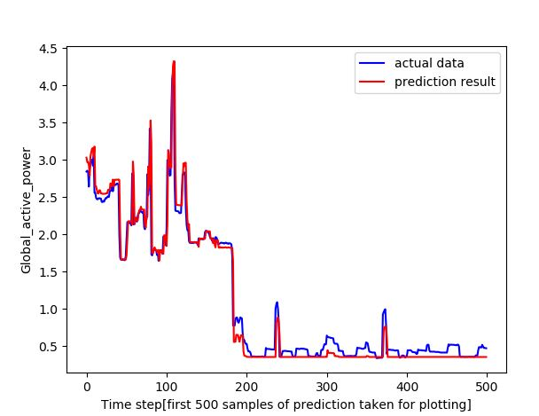

# Time-Series-using-LSTM-Global-Active-Power-prediction-
Project to predict Global Active Power at the time (t) given the Global Active Power measurement and other features at the prior time step(t-1)

Preprocessing steps:

    • I have deleted all rows having NaN values.

    • I have also deleted ‘Date’ and ‘Time’ column as the data is sorted by date-time.

    • And lastly, I have shifted the ‘Global_active_power’ column to form the output label as y.

Model architecture and parameters used for training the model:

    • Model is LSTM network with 100 neurons input layer and 15% dropout and 1 Dense output layer.
    
    • Input shape for our network is = [sample_size, time_step = 1, number_of_features = 7]
    
    • I have used ‘Adam’ optimizer with ‘mean squared error’ loss function.
    
    • Epochs = 5
    
    • Batch_size=128

Visualization of the comparison between the predicted and the actual values of our test dataset (300 sample from test dataset):

